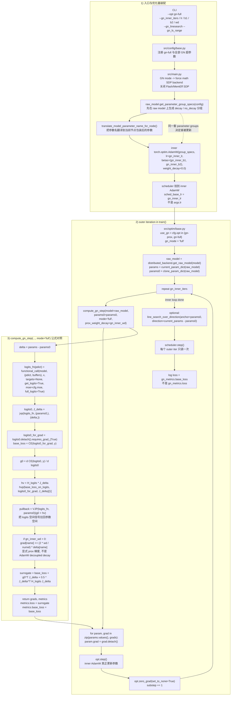

# GN-Full One Pager

基于当前仓库真实实现整理，目标是把 `--opt gn-full` 的调用链、公式映射、line search 与 scheduler 关系压在一页里。

## Formula Map

| 公式项 | 代码变量 | 代码位置 | 含义 |
| --- | --- | --- | --- |
| `delta = params - params0` | `delta` | `src/optim/gn.py` | 当前 inner 参数相对 outer anchor 的位移 |
| `J_delta` | `jvp_delta` | `src/optim/gn.py` | logits 对参数位移的雅可比方向项 |
| `logits0` | `logits0` | `src/optim/gn.py` | anchor `params0` 下的 full logits |
| `g0 = d CE(logits0, y) / d logits0` | `g0` | `src/optim/gn.py` | logits 空间的一阶梯度 |
| `hv = H_logits * J_delta` | `hv` | `src/optim/gn.py` | logits 空间二阶修正项 |
| `pullback = J^T (g0 + hv)` | `pullback = vjp_fn((g0 + hv).detach())[0]` | `src/optim/gn.py` | 把 logits 空间信号拉回参数空间 |
| `grad_param = pullback + d prox / d params` | `grad` | `src/optim/gn.py` | 供 inner AdamW 消费的最终参数梯度 |
| `surrogate = base_loss + g0^T J_delta + 0.5 J_delta^T H_logits J_delta` | `surrogate` | `src/optim/gn.py` | 只用于 metrics / logging，不直接输入 `opt.step()` |

## Key Distinctions

- `gn-full` 不是独立 `Optimizer` 子类；真正执行更新的是 inner `torch.optim.AdamW`。
- GN 负责“构造梯度”，AdamW 负责“带动量状态地更新参数”。
- `gn_inner_wd` 进入 `compute_gn_step(..., prox_weight_decay=...)`，不是 `AdamW(weight_decay=...)`。
- `scheduler.step()` 调的是 inner AdamW 的学习率；它按 outer iteration 调一次，不按 inner step 调。
- `line_search_over_direction()` 发生在全部 inner updates 之后，目标是 full model cross-entropy，不是 `surrogate`。
- 训练日志里的主 `loss` 取 `gn_metrics.base_loss`，而 `gn_metrics.loss` 在 `gn-full` 下是 `surrogate`。

