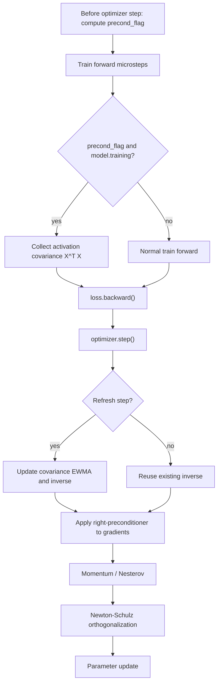

# Newton-Muon v1 Onepager

## Scope

This fork adds `--opt newton-muon` as a single-card dense Llama optimizer path.
It is intended as a benchmark-ready first integration of Newton-Muon semantics,
not as a replacement for the existing `muon` or `d-muon` baselines.

Current support:

- dense Llama only
- one device only
- PyTorch fallback preconditioner implementation
- AdamW fallback for embedding, head, norm, and 1D parameters

Current non-goals:

- DDP or multi-card training
- MoE models
- `d-muon` semantic alignment
- CUDA/Triton kernel optimization

## Algorithm Flow



The fixed update order is:

```text
train forward(refresh step only) collect X^T X
-> loss.backward()
-> optimizer.step refresh inverse/apply right-preconditioner
-> momentum
-> Newton-Schulz
-> update
```

## Statistics Semantics

`newton_muon_precond_every` is counted in optimizer steps / outer training
iterations. It is not counted in microsteps.

The training loop computes `precond_flag` once before the microstep loop. When
`acc_steps > 1`, every microstep in the same optimizer step shares that flag.
Therefore, a refresh step aggregates activation covariance from all train
forward microbatches in that outer optimizer step.

Activation covariance is collected in train forward only. It is not collected
after backward.

Evaluation does not update covariance. `eval_and_log()` uses the normal eval
path without passing `precond_flag`, and the Llama modules only collect when
`precond_flag` is true and `self.training` is true.

## Llama Mapping

Newton-Muon parameters use the same broad parameter split as Muon: 2D hidden
matrices are handled by Newton-Muon, while embedding, head, norm, and 1D
parameters use the AdamW fallback path.

Dense Llama covariance groups:

- QKV projection: one shared `d x d` input covariance
- attention output projection: one `d x d` covariance
- MLP expansion matrices: one shared `d x d` covariance
- MLP contraction matrix: four block-diagonal `d x d` covariance blocks

## Code Paths

- `src/config/base.py`: exposes `newton-muon` and `newton_muon_*` flags
- `src/main.py`: validates single-card dense Llama constraints and constructs `NewtonMuon`
- `src/models/llama.py`: collects activation covariance when `precond_flag and self.training`
- `src/optim/base.py`: computes one `precond_flag` per optimizer step and passes it to train forward
- `src/optim/newton_muon.py`: optimizer implementation, preconditioner state, inverse refresh, checkpoint state
- `scripts/124m/newton-muon.sh`: small-memory 124M benchmark entry

## 124M Small-Memory Entry

Run from the repository root:

```bash
bash scripts/124m/newton-muon.sh
```

The script uses:

- `n_embd=768`
- `n_head=12`
- `n_layer=12`
- `sequence_length=512`
- `batch_size=16`
- `acc_steps=2`
- `device=cuda:0`

It deliberately uses `python ./src/main.py`, not `torchrun`, and it does not set
`--distributed_backend nccl`.

The script keeps the benchmark-style W&B placeholder. For local machines
without W&B, remove:

```bash
--wandb --wandb_project YOUR_WANDB-PROJECT --wandb_entity YOUR-WANDB-ENTITY
```

This is a small-memory 124M entry. Its `batch_size=16, acc_steps=2` token budget
is not directly equivalent to the original `batch_size=64, acc_steps=4` recipe.
`iterations` and `eval_interval` currently follow the 124M script family until a
separate token-budget recalculation is done.

## Smoke Tests

Static checks:

```bash
python -m py_compile src/main.py src/optim/newton_muon.py src/optim/base.py src/models/llama.py
bash -n scripts/124m/newton-muon.sh
```

Tiny local smoke without W&B:

```bash
python ./src/main.py --config_format base --model llama --opt newton-muon \
  --dataset shakespeare-char --device cpu \
  --n_layer 1 --n_head 2 --n_embd 64 \
  --batch_size 1 --sequence_length 32 --iterations 2 \
  --warmup_steps 1 --eval_interval 2 --eval_batches 1 \
  --scheduler none --newton_muon_precond_every 2
```

Constraint checks:

- `--opt newton-muon --moe` should fail with a clear MoE unsupported error.
- `--opt newton-muon --distributed_backend nccl` should fail with a clear single-device error.
